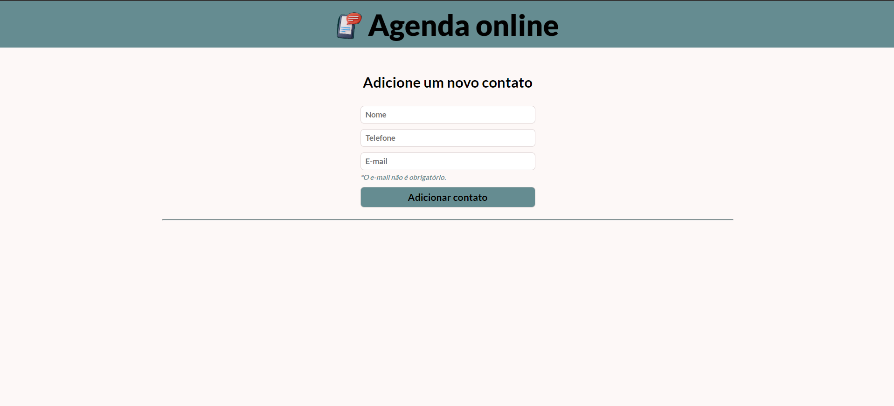
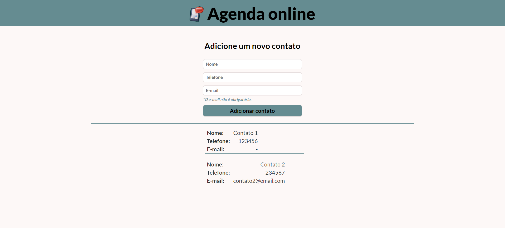
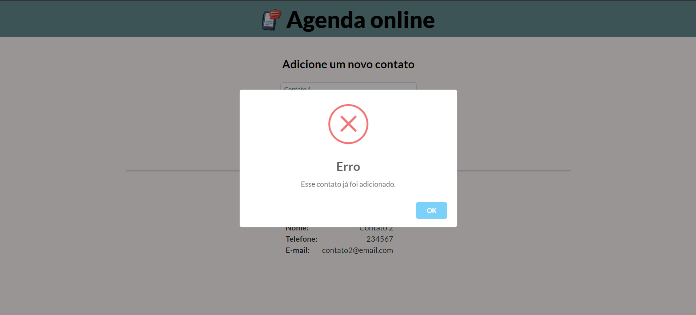

# Online Contact List


This application explores the use of the DOM to dynamically display information on the screen as the user interacts with it. It functions as an online contact list.

## Index
- <a href="#functionalities">Application functionalities</a>
- <a href="#layout">Layout</a>
- <a href="#demonstration">Demonstration</a>
- <a href="#run">How to run the application</a>
- <a href="#tecnologies-used">Tecnologies used</a>
- <a href="#developer">Developer</a>

## Application functionalities
 - [x]  Form to input contact information
 - [x]  Information shown as the user interacts with the application
 - [x]  The same contact can't be added more than one time

## Layout





## Demonstration
[Link (deploy)](https://contact-list-indol-iota.vercel.app/)


## How to run the application
```bash
# Clone this repository
$ git clone repolink

# Acess the app folder on your terminal
$ cd contact-list

# Utilize a local server launch tool to view the application in your browser

```

## Tecnologies used
1. HTML
2. CSS
3. DOM
4. Javascript

## Developer
[LinkedIn](https://www.linkedin.com/in/julia-silva-borges/)
